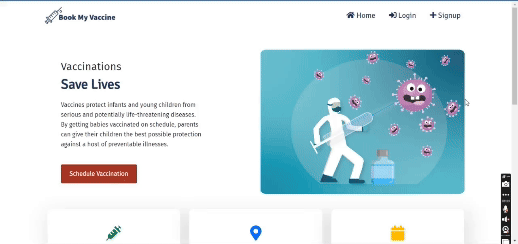

# Vaccination Scheduling App



## Overview

The Vaccination Scheduling App is a web application that helps parents and caregivers manage their children's vaccination schedules. It provides a user-friendly interface to track vaccine doses, set reminders, and access information about recommended vaccination schedules.

## Features

- **Available Vaccine**: View available vaccines, including the vaccine name, dose, and storage.

- **Scheduling**: View a calendar-based schedule of recommended vaccinations based on your child's age and the CDC's immunization guidelines.

- **Reminders**: Set push notifications or email reminders for upcoming vaccine doses to ensure your child stays up-to-date.

- **Vaccination centers and campaigns**: Access information about the importance of childhood vaccination, common vaccine-preventable diseases, and vaccine safety.

- **Vaccination Letter and Certificate**: Get a vaccination appointment letter and certificate.

## Technologies Used

- **Frontend**: HTML, CSS
- **Backend**: Python (Django)
- **Database**: SQLite

## Installation

To run the Vaccination Scheduling App locally, follow these steps:

1. Clone the repository:
   ```bash
   git clone https://github.com/mimi-netizen/Vaccination-Scheduling-App.git
   ```
2. Navigate to the project directory:
   ```bash
   cd Vaccination-Scheduling-App
   ```
3. Install the required dependencies:
   ```bash
   pip install -r requirements.txt
   ```
4. Run the application:
   ```bash
   python manage.py runserver
   ```
5. Access the app in your web browser at `http://localhost:8000`.

## Contributing

I welcome contributions to the Vaccination Scheduling App! If you would like to contribute, please follow these guidelines:

1. Fork the repository.
2. Create a new branch for your feature or bug fix.
3. Commit your changes and push to your forked repository.
4. Submit a pull request, describing the changes you have made.

## License

This project is licensed under the [MIT License](LICENSE).

## Contact

If you have any questions or feedback, please feel free to reach out to me at `celynekydd@gmail.com`.
